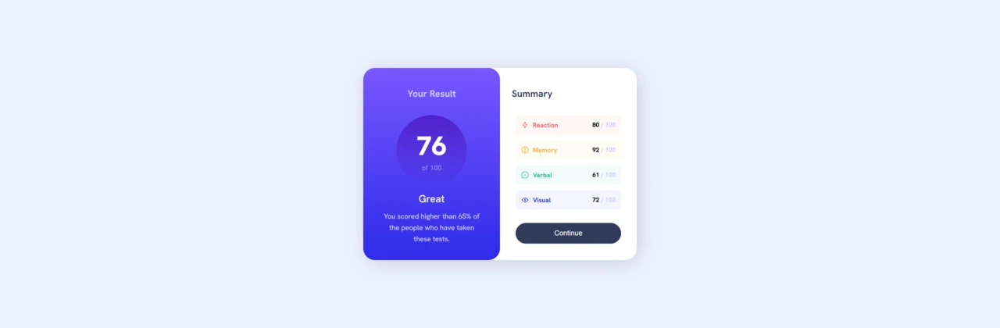

  
  <h2><a href="https://git.io/typing-svg"></h2>
  

    <a href="https://www.frontendmentor.io/challenges/news-homepage-H6SWTa1MFl"><strong>Frontend Mentor Challenge</strong></a>
     
     
    <a href="https://bennatbjoern.github.io/results-summary-component/">View Demo</a>
    &nbsp;·&nbsp;
    <a href="https://github.com/BennatBjoern/results-summary-component/issues">Report Bug</a>
    &nbsp;·&nbsp;
    <a href="https://github.com/BennatBjoern/results-summary-component/issues">Request Feature</a>
  

<!-- Badges -->

  <!-- Profiles -->
   &nbsp;&nbsp;&nbsp;

  <!-- Status -->
   &nbsp;&nbsp;&nbsp;

  <!-- Difficulty -->
  

 
 

## **Preview**

 

## **Links**

 |||
 | :----- | :----- |
 | Solution URL: | [Frontendmentor](https://www.frontendmentor.io/solutions/results-summary-component-using-flexbox-qUkFNNsdQT) |
 | Live Site URL: | [Github Pages](https://bennatbjoern.github.io/results-summary-component/) |
 |||

 

## The Challenge

- The challenge is to build out this Result Summary Component and get it looking as close to the design as possible.
- Users should be able to:
    - View the optimal layout for the site depending on their device's screen size
    - See hover states for all interactive elements on the page

 

## **Built With**

  &nbsp;  &nbsp;

 

## **Tools Used**

 &nbsp;  &nbsp;  &nbsp; 

 

## **Acknowledgment**

- Challenge was provided by [Frontend Mentor](https://www.frontendmentor.io)

 

## **Let's Connect 👋**

  &nbsp;&nbsp;&nbsp;

  &nbsp;&nbsp;&nbsp;

   &nbsp;&nbsp;&nbsp;

  

 
